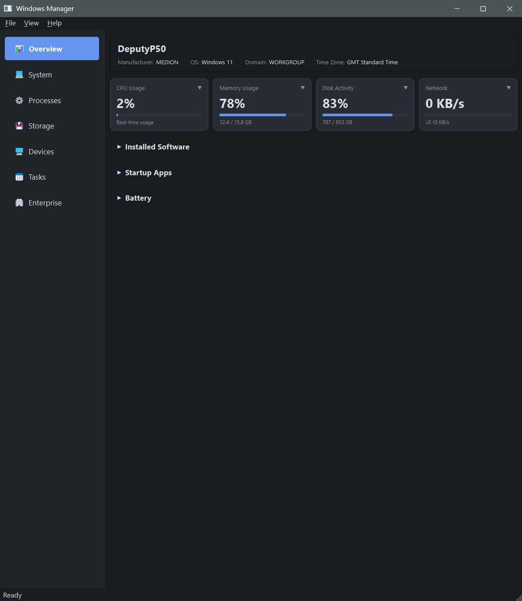
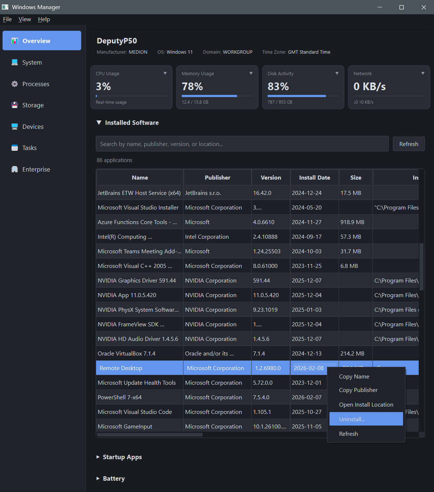
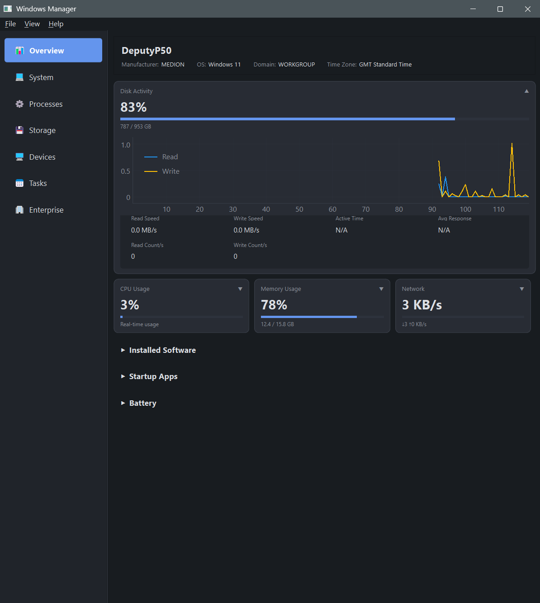
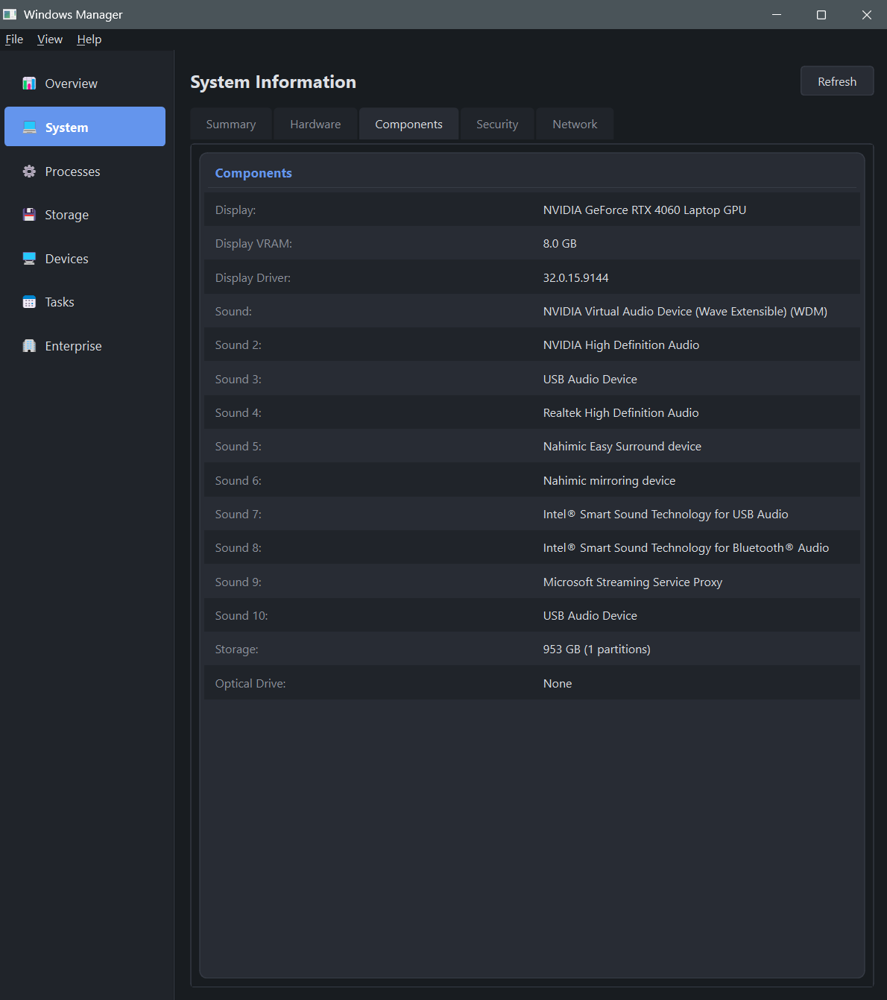
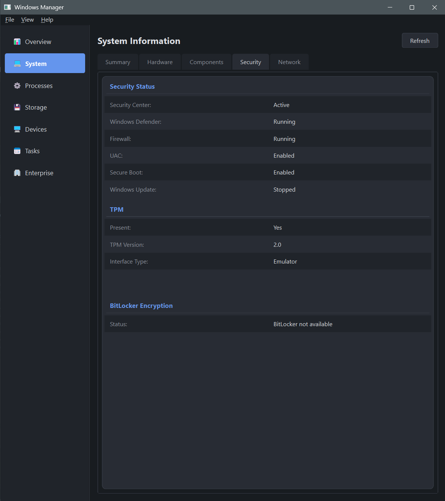
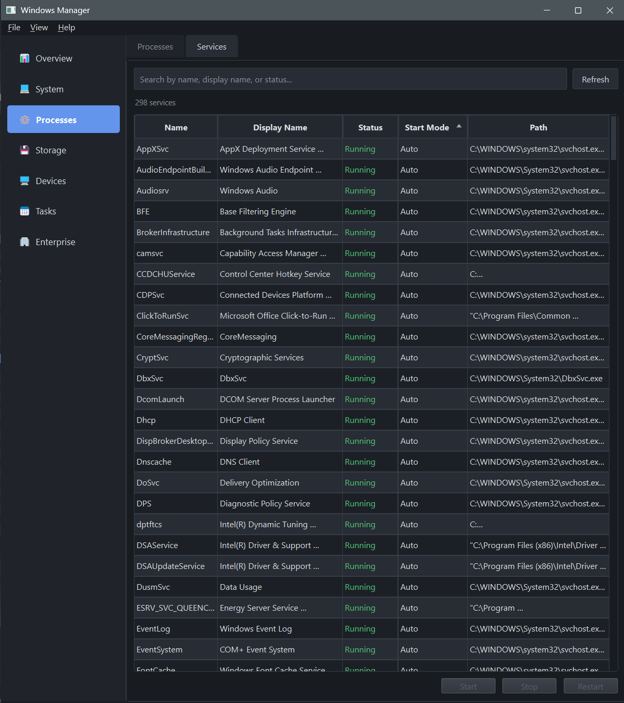
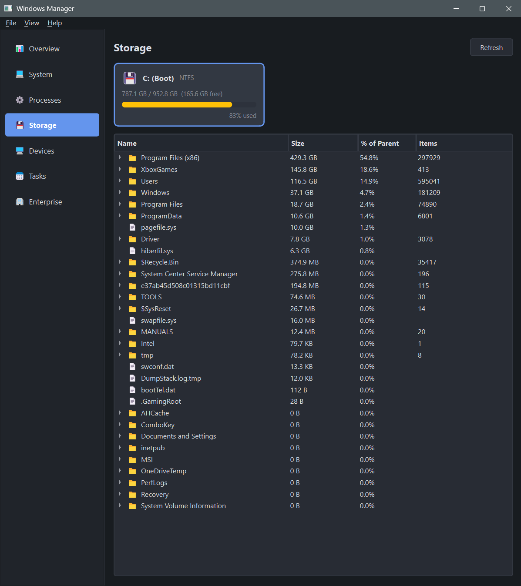
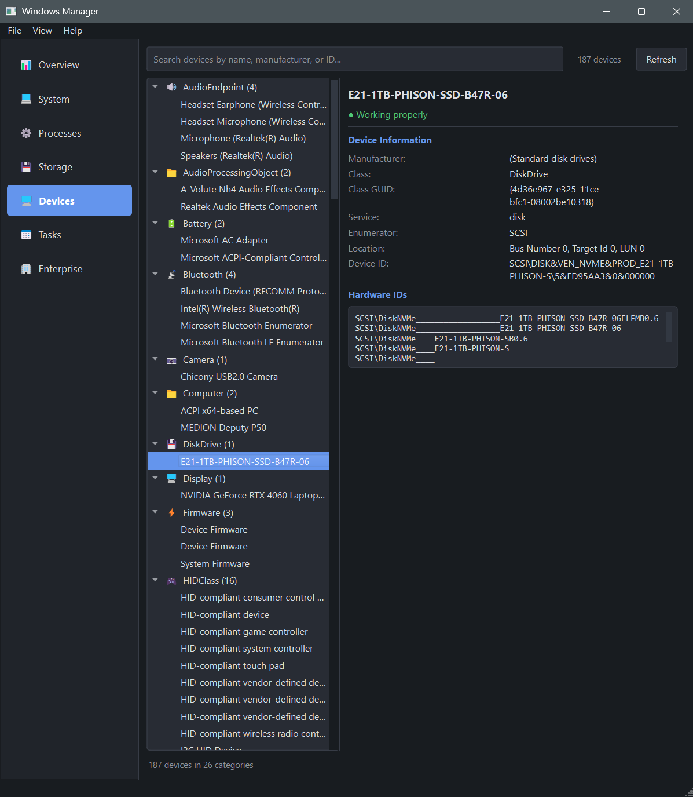
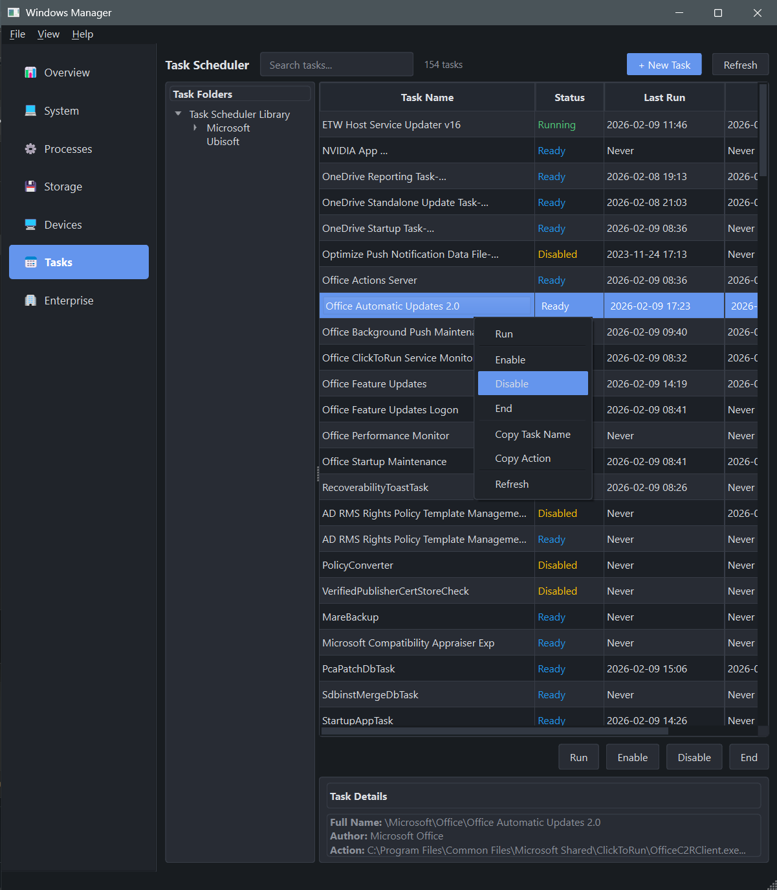
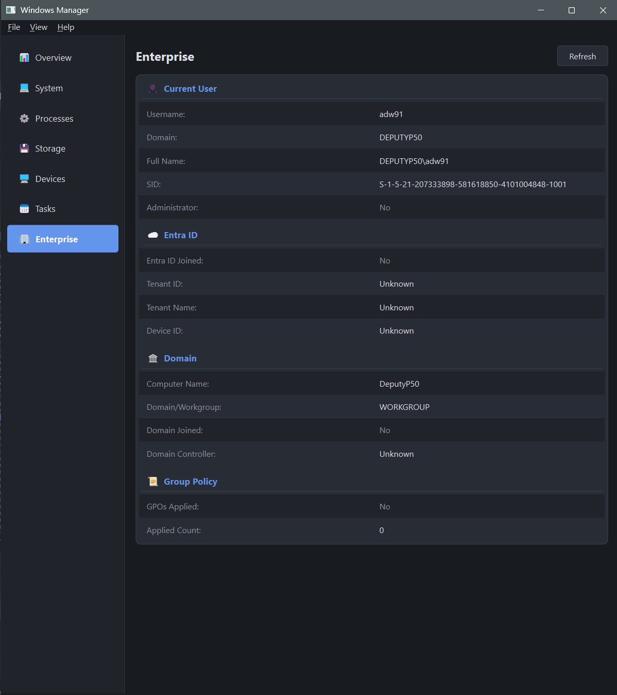

# Windows Manager

A lean combined system manager for Microsoft Windows that consolidates disparate views and reduces system noise.

## Overview

Windows Manager provides a unified interface for managing Windows system resources, processes, and services. Instead of juggling multiple built-in tools (Task Manager, Resource Monitor, Services, msinfo32, Device Manager, etc.), this tool brings essential information together in one clean interface.

## Features

### Overview

Live metrics dashboard with real-time graphs for CPU, memory, disk, and network. Includes installed software with context menus, startup apps, and battery health.

  

### System Information

Comprehensive system information (msinfo32-style) with tabbed sub-sections: Summary, Hardware, Components, Security, TPM, Network, Boot & Firmware.

 

### Processes & Services

Process monitoring with sorting, RAG coloring, and service management (start/stop/restart).

 

### Storage

Drive overview tiles with RAG usage bars, two-phase directory size scanning with cancellation.



### Devices

Native Device Manager with categorized device tree, driver details, and problem code indicators.



### Task Scheduler

View, create, and manage scheduled tasks with folder navigation, schedule configuration, and context menus.



### Enterprise

User info, Entra ID status, domain/workgroup, and Group Policy details.



See [PROJECT_OVERVIEW.md](docs/PROJECT_OVERVIEW.md) for detailed feature documentation.

## Technology Stack

- Python 3.13 / PySide6
- psutil, pywin32, pyqtgraph, numpy
- Native Win32 APIs via ctypes:
  - NtQuerySystemInformation (process enumeration)
  - SetupAPI / CfgMgr32 (device enumeration)
  - TBS (TPM detection)
  - kernel32, userenv (system info, security)

## Getting Started

### Standalone Executable

No Python installation required. Run the pre-built executable:
```
dist\WinManager\WinManager.exe
```

Some features (BitLocker status, TPM details, service management) require administrator privileges.

### From Source

Requires Python 3.13+ and Windows 10/11.

```bash
python -m venv venv
venv\Scripts\activate
pip install -r requirements.txt
run.bat
```

### Building the Executable

```bash
pip install pyinstaller
pyinstaller WinManager.spec
```

The output is written to `dist\WinManager\`.

### Keyboard Shortcuts

| Shortcut | Action |
|----------|--------|
| Ctrl+1–7 | Switch tabs (Overview, System, Processes, Storage, Devices, Tasks, Enterprise) |
| F5 | Refresh current tab |

## License

MIT
